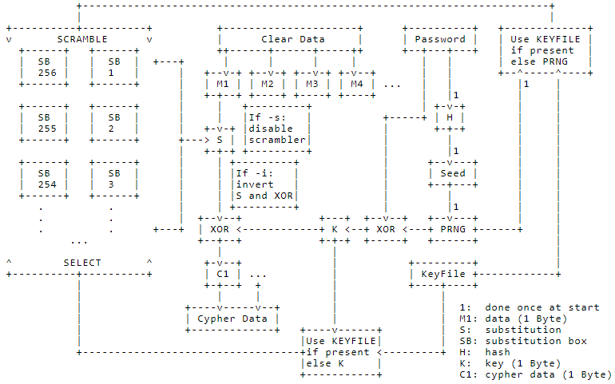

enigmax
=====
permet de chiffrer et de déchiffrer toutes les données entrées en paramètre.     
Le mot de passe demandé au début est hashé puis sert de graine pour le PRNG(générateur de nombre aléatoire).    
Le PRNG permet de fournir une clé unique égale à la longueur du fichier à coder.    
La clé unique subit un xor avec le mot de passe (le mot de passe est répété autant de fois que nécéssaire).    
Le fichier subit un xor avec cette clé Puis un brouilleur est utilisé, il mélange la table des caractères (ascii) en utilisant le PRNG et en utilisant le keyfile s'il est fourni.    
256 tables de brouillages sont utilisées au total dans un ordre non prédictible.

Can crypt and decrypt any file given in argument.    
The password asked is hashed to be used as a seed for the PRNG.    
The PRNG gives a unique key which has the same length as the source file.    
The key is xored with the password (the password is repeated as long as necessary).    
The file is then xored with this new key, then a scrambler is used.    
it scrambles the ascii table using the PRNG or the keyFile given.
256 scramble's tables are used in an unpredictible order.


## Installation
MAC:
```
clang -Ofast -fno-unroll-loops main.c -o enigmax
```

LINUX:
```
gcc -fno-move-loop-invariants -fno-unroll-loops main.c -std='c11' -o enigmax
```

You can put the compiled file "enigmax" in your path to use it everywhere
```
export PATH="$PATH:/PATH/TO/enigmax"
```
Or you can make an alias
```
alias enigmax='PATH/TO/enigmax'
```
write one of them in your ~/.bashrc if you want it to stay after a reboot

## Usage :

```
./enigmax [options] FILE [KEYFILE]
```

### Options :

**-h | --help:**
  *further help.*

**-s (simple):** 
  *put the scrambler off*

**-i (inverted):**
  *inverts the coding/decoding process, first it xors then it scrambles*

**-n (normalised):**
  *normalise the size of the keyFile, improving too short (less secure) or too long (take long time) keyFiles*

**-d (destroy):**
  *delete the source file at the end of the process*
  
**KEYFILE:**
  *path to the keyfile, generate the scrambler instead of the password.*


## Example :


**the command:**

```
enigmax file1
```

lets you choose between crypting or decrypting then it will prompt for a password that crypt/decrypt file1 as xfile1 in the same folder, file1 is not modified.

**the command:**

```
enigmax file2 keyfile1
```

lets you choose between crypting or decrypting, will prompt for the password that crypt/decrypt file2, uses keyfile1 to generate the scrambler then crypt/decrypt file2 as xfile2 in the same folder, file2 is not modified.

**the command:**

```
enigmax -s file3
```

lets you choose between crypting or decrypting, will prompt for a password that crypt/decrypt the file without using the scrambler(option 's'), resulting in using the unique key only.

**the command:**

```
enigmax -i file4 keyfile2
```

lets you choose between crypting or decrypting, uses keyfile2 to generate the scramble table and will prompt for a password that crypt/decrypt the file but will inverts the process(option 'i'): first it xors then it scrambles for the coding process or first it unscrambles then it xors for the decoding process

**the command:**

```
enigmax -dni file4 keyfile2
```

lets you choose between crypting or decrypting, will prompt for a password that crypt/decrypt the file but generates the substitution's tables with the keyfile passing only one cycle of the Fisher & Yates algorythm(option 'n'), inverts the scrambling phase with the xoring phase(option 'i') and destroy the source file afterwards(option 'd')

## How it works


